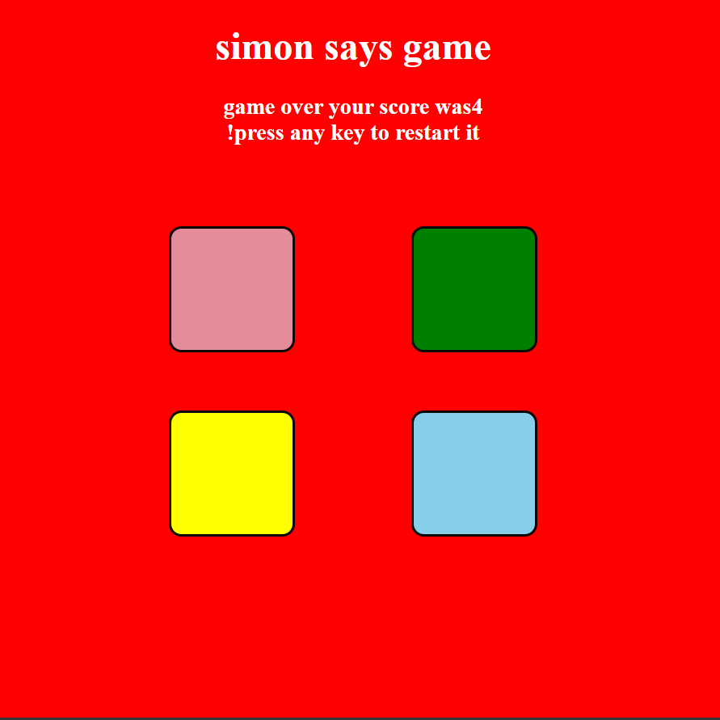

# 🧠 Simon Game

A browser-based memory game inspired by the classic **Simon electronic game**.  
Repeat the flashing color sequences to level up — how far can your memory go?

## 🎮 How to Play

1. Press **any key** to start.
2. **Watch** the pattern of colors as they flash and play sounds.
3. **Click** the colors in the same sequence.
4. With each level, a new color is added to the sequence.
5. Make a mistake? The game ends and you can start again.

## ✨ Features

- Level-based increasing difficulty
- Button click animations
- Game over detection and restart mechanism
- Fully responsive design using only HTML, CSS, and JS

## 🔧 Technologies Used

- HTML5
- CSS3
- JavaScript (Vanilla)

## 📸 Screenshots

  

  

  

